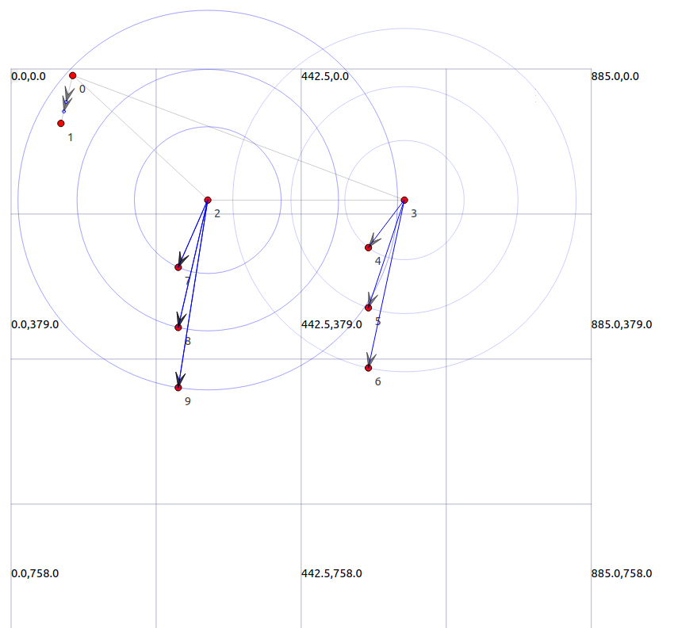

# LTE-handover-scenario
this code is implemented with NS3 as a simulation of 6 mobile nodes and 2 eNodeB (node 2 and 3) making a simple handover 
the two eNodeB are connected to a core network (node 0 and 1)

## To run build the ns3 code
just copy the file **new_lte.cc** to the scratch folder the execute the build comand `./waf --run scratch/new_lte` 
a new file called **lte_handover_anim.xml** which is the same file in this repo.

## To view the simulation use Netanim. 

